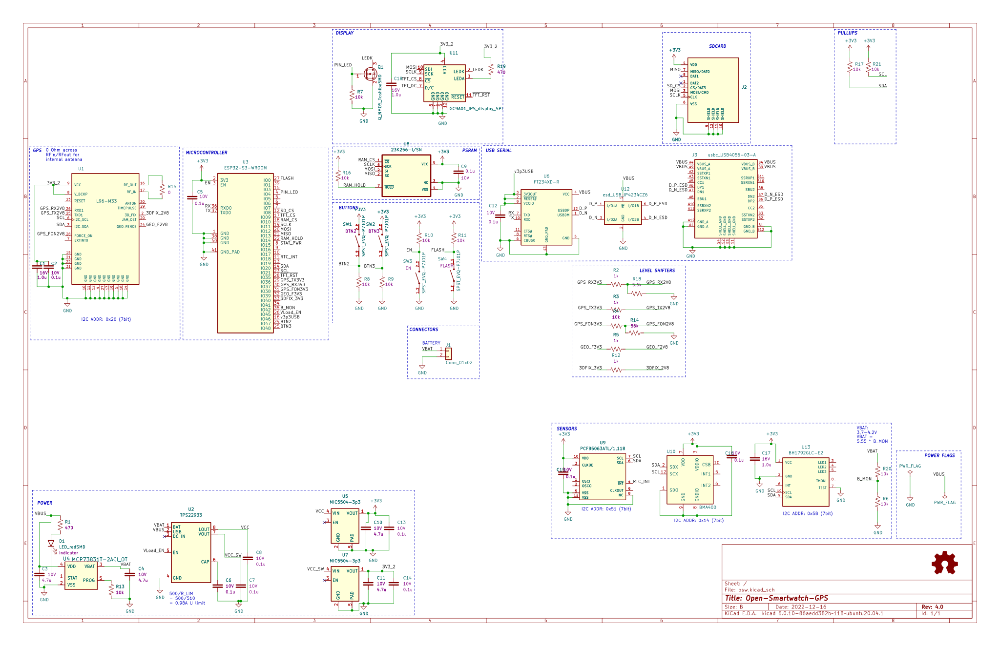

# Open-Smartwatch KiCAD files

Repo for kicad schematic, board and gerber files. This project is in development and is not ready for release.

If all you want to know is how to build skip down to [Build Info](##Build Info)

#### Forking to move forward

The [original project ](https://github.com/Open-Smartwatch/open-smartwatch-gps) seems to have lost some momentum on development.  There is an [issue here](https://github.com/Open-Smartwatch/open-smartwatch-gps/issues/10) to discuss merging these changes into the original project.  One of the goals of this fork and update is to minimize any serious changes to [the os](https://github.com/Open-Smartwatch/open-smartwatch-os).  If all goes well, the OS should be able to be dropped on here with little to no modifications.  (that is the goal time will tell for sure.)

Right now this is a 2 layer design.  If this works it will greatly reduce the overall cost.  Have to see how this performs.

## Tools

To view/modify the files from this repository install [KiCAD](https://kicad.org).  You'll need version 7.0 or higher.  This will be bumped in Janurary of 2024 to KiCad 8.0.

All footprints, schematic symbols and 3d models should be self contained winthin the project.  This means you should be able to open the kicad project anywhere with or without the default kicad libraries and play with things without worry about missing pieces.

## Schematic
Updated as of 10/20/2023.  May change but if it does it should be minor changes.

Update on 1/7/2024.... Happy New Year to all!  Been quite for awhile as getting boards built and tested took quite a while.  Found a few issues.  Working on fixing them before another spin.  Probably be respinning sometime around May...?

## Plots

## Build Info

To get some raw PCBs the best way would be [pcbway](https://pcbway.com).  Once this project has been built and tested the design will be published on pcbway for anyone to order with a couple clicks.

Next you'll have to either build this yourself or get these fabricated.  If you want to get the boards fabricated pcbway does a decent job.  You'll have to export the position files and put the BOM in pcbway format.

If you choose to solder these youself the smallest components are 0402 and QFNs.  Not the most friendly but can be done with a decent soldering iron.

### BOM

NOTE: **This is a preliminary BOM**  After testing this could change some.

[HTML BOM](https://github.com/a-allard/open-smartwatch-gps/blob/master/bom/OSW_GPS_Rev-4.0.html)  (best to download for a pretty view)

For actual parts you'll need
* [Digi-Key cart](https://www.digikey.com/short/5wz73v93) with most everything needed for a build of 1.
* [Display](https://www.buydisplay.com/1-28-inch-tft-lcd-display-240x240-round-circle-screen-for-smart-watch)
* A LiPo battery (Has not yet been selected but you should be able to power this from USB for initial debugging.  Any generic lipo should work just make sure the pinout works with the connector)

Total cost from DK ~$55.  The display is ~$15 including shipping.  With a battery this should bring the total BOM cost per watch to about ~$110 including boards from pcbway.com.  Note this is for a single watch but you'll have to order 5 boards from pcbway.com

Don't forget to get some decent fine solder while or solder paste as you will need it!

If you like this project, please consider supporting my open source projects through: 

